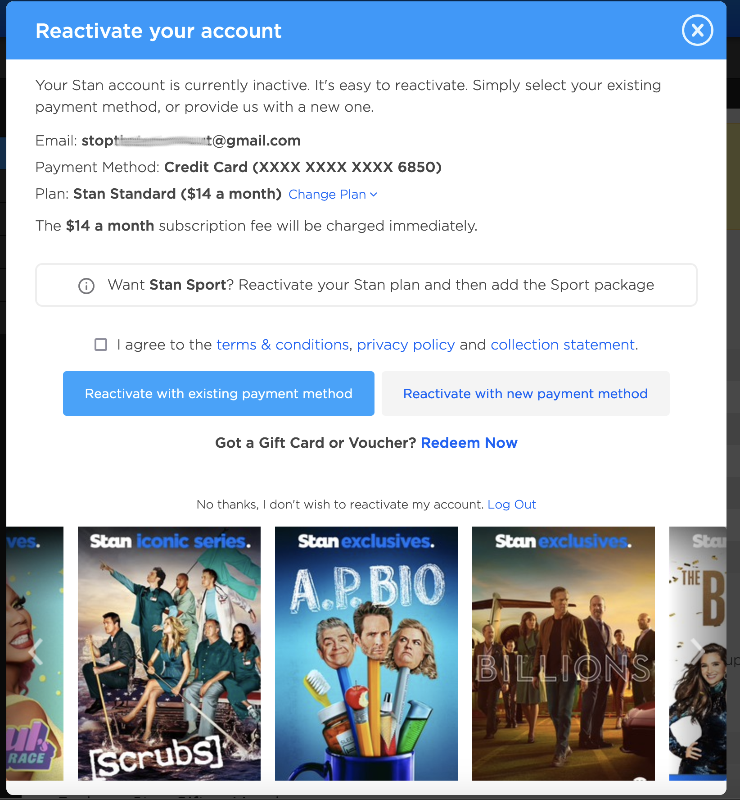

# Stan Login Issue

## Abstract

Some time ago, I deactivated my Stan account. Let's face it, there's so much Streaming Media out there, one cannot consume it all. My girlfriend arrived with Netflix and Stan Subscriptions, I arived with Stan, Foxtel and Prime, easy to see which was going to lose out. So I turned off Stan. We watch hers now.

Then I discovered via Dashlane that I'd has a password breach from another site, the password for which I'd imprudently re-used for my Stan account

So I went off to Stan.com.au to change that password. And I found... I can't do that.

The only option is to pay up or log out.

So I have to pay $14 to change my password, on a credit card that Stan _has remembered_.

* Yeah, don't worry, that credit card is already cancelled.

## So... the bad guy...

... logs in with the leaked credentials. Then:

- Uses the saved CC number to pay for a month
- changes the password on the account
- hopes the original account owner doesn't notice
- gets to watch a bunch all of Twin Peaks for freeeeeee (probably over a VPN)

## Conclusion

Stan should fix this, so that lapsed subscribers can change their passwords OR remove their accounts without needing to resubscribe.
